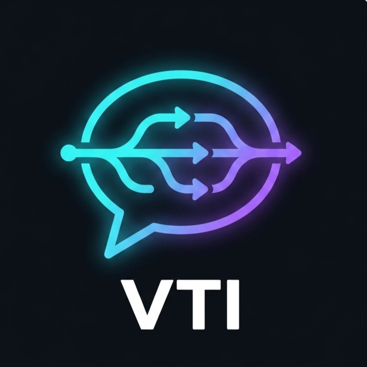

# VTI SDLC Skill Framework

<div align="right">
  <strong>🇬🇧 English</strong> &nbsp;|&nbsp; <a href="README.vi.md">🇻🇳 Tiếng Việt</a>
</div>

<p align="center">
  
</p>

<p align="center">
  
  <br><br>
  <em>A <strong>Claude Code</strong> skill pack covering the full Software Development Lifecycle (SDLC) — from requirements analysis to deployment.</em>
  <br>
  <em>Optimized for the outsource model: <strong>VN Dev Team ↔ Bridge Engineer ↔ Japanese Client</strong>.</em>
</p>

---

## Why this framework?

- **21 slash commands** ready for every role: PM, BA, Dev, QA, Arch, DevOps, SM, BE
- **Human Gate** at every step — Claude never acts autonomously, always presents → asks → waits for confirmation
- **Multi-agent** for dev tasks — keeps context clean, saves tokens
- **Two-tier docs** — ephemeral task docs + living baseline docs alongside the code
- **JP standards** — `/be:bridge` generates 設計書 and 単体テスト仕様書 ready to send to the client

---

## Requirements

| Tool | Version | Notes |
|------|---------|-------|
| [Claude Code](https://claude.ai/code) | Latest | CLI or IDE extension |
| [GitHub CLI](https://cli.github.com/) | ≥ 2.0 | Used in `/pm:breakdown` to create issues |
| Git | ≥ 2.0 | |

---

## Installation

### Option 1 — New project (recommended)

**Windows (PowerShell):**
```powershell
git clone https://github.com/hiep18101997/Agentic-Development-Lifecycle.git my-project
cd my-project
.\setup.ps1 -TargetPath "C:\path\to\your\project"
```

**macOS / Linux:**
```bash
git clone https://github.com/hiep18101997/Agentic-Development-Lifecycle.git my-project
cd my-project
chmod +x setup.sh && ./setup.sh /path/to/your/project
```

### Option 2 — Add to existing project

**Windows (PowerShell):**
```powershell
git clone https://github.com/hiep18101997/Agentic-Development-Lifecycle.git vti-sdlc-tmp
cd vti-sdlc-tmp
.\setup.ps1 -TargetPath "C:\path\to\your\existing\project"
cd ..
Remove-Item vti-sdlc-tmp -Recurse -Force
```

**macOS / Linux:**
```bash
git clone https://github.com/hiep18101997/Agentic-Development-Lifecycle.git vti-sdlc-tmp
cd vti-sdlc-tmp && chmod +x setup.sh
./setup.sh /path/to/your/existing/project
cd .. && rm -rf vti-sdlc-tmp
```

### Option 3 — Manual

Copy the following directories into your project root:

```
your-project/
├── .claude/          ← copy from framework
├── agents/           ← copy from framework
├── templates/        ← copy from framework
├── CLAUDE.md         ← copy and customize
└── docs/             ← create new with structure below
    ├── api/
    ├── screens/
    ├── tasks/
    ├── decisions/
    └── workflows/
```

---

## After installation

**Step 1** — Open `CLAUDE.md` and update the VTI Context section:

```markdown
**Company**: [Company / project name]
**Client**: [JP client name if applicable]
**Model**: VN Dev Team ↔ Bridge Engineer (BE) ↔ JP Client
**Language**: Code comments = English; Internal docs = Vietnamese
**Timezone**: JST (UTC+9) — or client's timezone
**Tech stack**: [Node.js / React / PostgreSQL / ...]
**Repo**: [GitHub URL]
```

**Step 2** — Open the project in Claude Code:

```bash
claude .
```

**Step 3** — Type `/` to see all available commands:

```
/pm:ideate    /ba:spec    /dev:analyze    /qa:testplan    ...
```

---

## Project Structure

```
.claude/
└── commands/           # 21 slash commands — type / in Claude Code
    ├── arch/           # adr.md  review.md
    ├── ba/             # spec.md  user-story.md
    ├── be/             # bridge.md  (JP outsource)
    ├── dev/            # analyze.md  implement.md  pr.md  debug.md
    ├── docs/           # update.md
    ├── ops/            # deploy.md  incident.md
    ├── pm/             # ideate.md  breakdown.md  status.md
    ├── qa/             # testplan.md  bug.md  regression.md
    ├── sec/            # review.md
    └── sm/             # standup.md  retro.md

agents/                 # Subagent definitions (used by orchestrator commands)
    task-reader.md      # Parse GitHub issue → JSON
    code-scout.md       # Find related code → JSON
    planner.md          # Generate implementation options → JSON
    diff-reader.md      # Map git diff → AC coverage → JSON
    test-gen.md         # Generate test cases
    doc-updater.md      # Propose doc updates → JSON

templates/              # Skeleton templates for all document types
    task-doc-requirements.md
    baseline-api.md
    baseline-screen.md
    adr.md
    github-issue.md
    pr-description.md

docs/
    workflows/          # Sprint lifecycle + role guide
    tasks/              # Task docs (1 folder per issue) — gitignored per project
    api/                # API baseline docs — long-lived
    screens/            # Screen baseline docs — long-lived
    decisions/          # Architecture Decision Records
```

---

## Commands Reference

### PM (Project Manager)

| Command | Description | Input → Output |
|---------|-------------|----------------|
| `/pm:ideate` | Turn a vague idea into a clear concept | Rough idea → One-pager + Not Doing list |
| `/pm:breakdown` | Break Epic into tasks, create GitHub Issues | User Stories → Issues |
| `/pm:status` | Sprint status report | — → Status summary |

### BA (Business Analyst)

| Command | Description | Input → Output |
|---------|-------------|----------------|
| `/ba:spec` | Convert raw requirements into structured spec | Raw requirement → `docs/tasks/[ID]/requirements.md` |
| `/ba:user-story` | Generate User Stories from spec | requirements.md → User Stories + AC |

### Bridge Engineer — JP Outsource

| Command | Description | Input → Output |
|---------|-------------|----------------|
| `/be:bridge` | Translate JP↔VN, generate 設計書 + dev spec | JP requirement → `requirements.md` (VN) + `design-jp.md` (JP) |

### Developer

| Command | Description | Input → Output |
|---------|-------------|----------------|
| `/dev:analyze` | Analyze task, propose 2-3 implementation options | Issue + Brain Dump → `analysis.md` |
| `/dev:implement` | Implement file-by-file with human gates | `analysis.md` → Code |
| `/dev:pr` | Generate PR description | Code diff → PR description |
| `/dev:debug` | Structured debugging: reproduce → localize → fix | Bug report → Fix |

### Security

| Command | Description | Input → Output |
|---------|-------------|----------------|
| `/sec:review` | 3-tier security review before merge | Code diff → Findings |

### QA

| Command | Description | Input → Output |
|---------|-------------|----------------|
| `/qa:testplan` | Generate test plan from spec | requirements.md → `test-plan.md` |
| `/qa:bug` | Standardized bug report | Bug → Issue template |
| `/qa:regression` | Regression checklist before release | Release scope → Checklist |

### Architect

| Command | Description | Input → Output |
|---------|-------------|----------------|
| `/arch:review` | Review design decision | Design → Findings |
| `/arch:adr` | Generate Architecture Decision Record | Decision → `docs/decisions/ADR-NNN.md` |

### DevOps

| Command | Description | Input → Output |
|---------|-------------|----------------|
| `/ops:deploy` | Deployment checklist + CI quality gate | — → Checklist |
| `/ops:incident` | Incident response + RCA | Incident → Response plan |

### Scrum Master

| Command | Description | Input → Output |
|---------|-------------|----------------|
| `/sm:standup` | Daily standup summary | Updates → Summary |
| `/sm:retro` | Sprint retrospective | — → Retro doc |

### All Roles

| Command | Description | Input → Output |
|---------|-------------|----------------|
| `/docs:update` | Update baseline docs after verify & merge | Diff + verify → Updated docs |

---

## Typical Workflows

<p align="center">
  
</p>

### Full sprint (end to end)

```
/pm:ideate → /ba:spec → /ba:user-story → /pm:breakdown
    → /dev:analyze → /dev:implement → /sec:review → /dev:pr
    → /qa:testplan → [QA execute] → /docs:update
    → /qa:regression → deploy
```

### Receiving requirements from Japanese client

```
/be:bridge → /ba:spec → /ba:user-story → /pm:breakdown → ...
```

### Got an issue, need to code now

```
/dev:analyze → /dev:implement → /sec:review → /dev:pr
```

Full step-by-step: [`docs/workflows/sprint-lifecycle.md`](docs/workflows/sprint-lifecycle.md)  
Who uses which skill: [`docs/workflows/role-guide.md`](docs/workflows/role-guide.md)

---

## Design Principles

| # | Principle | Meaning |
|---|-----------|---------|
| 1 | **Human Gate** | Claude never acts alone — always present → ask → wait for confirm |
| 2 | **Multiple Options** | Always offer 2-3 options with trade-offs. Never a single solution |
| 3 | **Fresh Context** | Subagents receive only the context they need — no full history passed |
| 4 | **Two-tier Docs** | Task docs (ephemeral) + Baseline docs (living, updated after verify) |
| 5 | **Delta Specs** | Each change is a structured proposal, not a monolith |
| 6 | **Template-first** | Commands reference templates, never duplicate format inline |

---

## Customization

### Add custom commands

Create a file at `.claude/commands/[role]/[command].md`:

```markdown
# Skill: /[role]:[command]
**Role**: [Role]
**Purpose**: [Description]

## Instructions
...
```

### Add domain-specific rules

Open `CLAUDE.md` and append:

```markdown
## Project-specific Rules

- [Project-specific rule]
- Enum values: [list]
- Forbidden patterns: [list]
```

### Disable unused commands

Delete the corresponding file from `.claude/commands/`. No impact on other commands.

---

## For VTI teams — JP Outsource

The framework supports VTI's 3-layer outsource model:

```
JP Client ←→ Bridge Engineer ←→ VN Dev Team
  JP doc  ←   /be:bridge     →   VN spec
```

**Bridge Engineer** uses `/be:bridge` to:
- Translate JP requirements → Vietnamese spec for dev team
- Generate 設計書 (Basic/Detail Design) to Japanese SI standards
- Generate 単体テスト仕様書 to send to client for confirmation
- Built-in JP↔VN glossary for consistency

Deliverables map:

| JP Deliverable | Framework file |
|----------------|----------------|
| 基本設計書 | `docs/screens/` + `docs/api/` |
| 詳細設計書 | `docs/tasks/[ID]/analysis.md` |
| 単体テスト仕様書 | `docs/tasks/[ID]/test-plan.md` |
| 単体テスト結果 | `docs/tasks/[ID]/verification.md` |

---

## Contributing

1. Fork the repo
2. Create a branch: `feature/[command-name]` or `fix/[issue]`
3. Add/edit commands in `.claude/commands/[role]/`
4. Update `CLAUDE.md` if adding a new command
5. Open a PR with a complete description

**Command writing conventions:**
- Always include at least 1 Human Gate (wait for confirm)
- Always propose 2-3 options when a decision is needed
- Output must be actionable — not just explanatory
- Subagents: use the Agent tool, pass minimal context

---

## License

MIT — Free to use and customize for your own projects.
