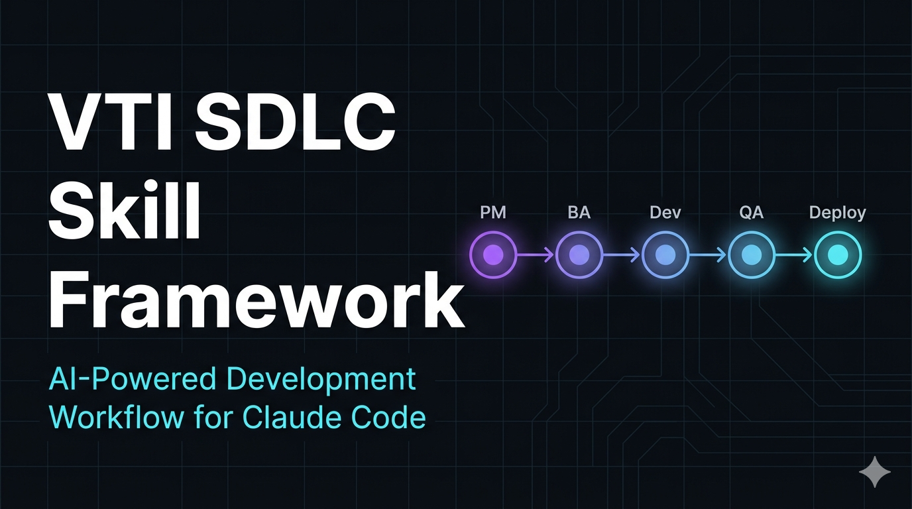
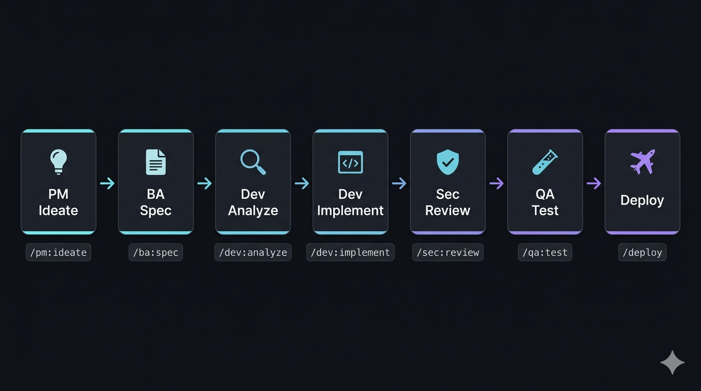

# VTI SDLC Skill Framework

<div align="right">
  <a href="README.md">🇬🇧 English</a> &nbsp;|&nbsp; <strong>🇻🇳 Tiếng Việt</strong>
</div>

<p align="center">
  
</p>

<p align="center">
  <br><br>
  <em>Bộ skill cho <strong>Claude Code</strong> hỗ trợ toàn bộ vòng đời phần mềm (SDLC) — từ phân tích yêu cầu đến deploy.</em>
  <br>
  <em>Tối ưu cho mô hình outsource: <strong>Team VN ↔ Bridge Engineer ↔ Khách hàng Nhật</strong>.</em>
</p>

---

## Tại sao dùng framework này?

- **21 slash commands** sẵn sàng cho mọi role: PM, BA, Dev, QA, Arch, DevOps, SM, BE
- **Human Gate** tại mỗi bước — Claude không bao giờ tự làm thay, luôn chờ confirm
- **Risk Classifier** — mọi task được phân loại tiny / normal / high-risk trước khi bắt đầu
- **Multi-agent** cho dev tasks — giữ context sạch, tiết kiệm token
- **Two-tier docs** — task docs riêng + baseline docs sống cùng code
- **Tự cải tiến** — agent ghi friction vào `docs/improvement-backlog.md` trong lúc làm việc
- **Chuẩn JP** — `/be:bridge` tạo 設計書, 単体テスト仕様書 sẵn gửi khách

---

## Yêu cầu

| Tool | Phiên bản | Ghi chú |
|------|-----------|---------|
| [Claude Code](https://claude.ai/code) | Latest | CLI hoặc IDE extension |
| [GitHub CLI](https://cli.github.com/) | ≥ 2.0 | Dùng trong `/pm:breakdown` để tạo issues |
| Git | ≥ 2.0 | |

---

## Cài đặt

### Cách 1 — npx (khuyến nghị, không cần git)

```bash
npx github:hiepdnh/Agentic-Development-Lifecycle
```

Chạy từ thư mục gốc project. Dùng được trên Windows, macOS, Linux. Không cần clone, không script shell, không bị permission block. Yêu cầu Node.js ≥ 16.

Bỏ qua confirm prompt (non-interactive / CI):
```bash
npx github:hiepdnh/Agentic-Development-Lifecycle --yes
```

**Đã cài rồi? Cập nhật lên phiên bản mới nhất:**
```bash
npx github:hiepdnh/Agentic-Development-Lifecycle --update
# non-interactive:
npx github:hiepdnh/Agentic-Development-Lifecycle --update --yes
```

`--update` ghi đè các skill file hiện có bằng phiên bản mới nhất. Các file riêng của project (`docs/`, `agents/`, custom commands) không bị ảnh hưởng.

### Cách 2 — Dùng lệnh `/install` trong Claude Code

Mở project trong Claude Code, gõ:
```
/install
```
Claude dùng file tools của mình để copy framework — không cần shell.

### Cách 3 — One-liner với `gh`

**Windows (PowerShell):**
```powershell
gh repo clone hiepdnh/Agentic-Development-Lifecycle -- --depth=1 "$env:USERPROFILE\.claude\ADL"; & "$env:USERPROFILE\.claude\ADL\setup.ps1" -TargetPath (Get-Location) -Yes
```

**macOS / Linux:**
```bash
gh repo clone hiepdnh/Agentic-Development-Lifecycle -- --depth=1 ~/.claude/ADL && bash ~/.claude/ADL/setup.sh "$(pwd)"
```

### Cách 4 — Clone thông thường

**Windows (PowerShell):**
```powershell
git clone https://github.com/hiepdnh/Agentic-Development-Lifecycle.git ten-du-an
cd ten-du-an
.\setup.ps1 -TargetPath "C:\path\to\your\project"
```

**macOS / Linux:**
```bash
git clone https://github.com/hiepdnh/Agentic-Development-Lifecycle.git ten-du-an
cd ten-du-an
chmod +x setup.sh && ./setup.sh /path/to/your/project
```

### Cách 5 — Thủ công

Copy các thư mục sau vào root của project:

```
your-project/
├── .claude/          ← copy từ framework
├── agents/           ← copy từ framework
├── templates/        ← copy từ framework
├── CLAUDE.md         ← copy và customize
└── docs/             ← tạo mới với cấu trúc bên dưới
    ├── api/
    ├── screens/
    ├── tasks/
    ├── decisions/
    └── workflows/
```

---

## Sau khi cài đặt

**Bước 1** — Mở `CLAUDE.md` và cập nhật phần VTI Context:

```markdown
**Công ty**: [Tên công ty / project]
**Khách hàng**: [Tên khách hàng JP nếu có]
**Model**: Team dev VN ↔ Bridge Engineer (BE) ↔ Khách hàng JP
**Ngôn ngữ**: Code comments = tiếng Anh; Tài liệu nội bộ = tiếng Việt
**Timezone**: JST (UTC+9) — hoặc timezone của khách hàng
**Tech stack**: [Node.js / React / PostgreSQL / ...]
**Repo**: [GitHub URL]
```

**Bước 2** — Mở project trong Claude Code:

```bash
claude .
```

**Bước 3** — Gõ `/` để xem danh sách commands:

```
/pm:ideate    /ba:spec    /dev:analyze    /qa:testplan    ...
```

---

## Cấu trúc dự án

```
.claude/
└── commands/           # 21 slash commands — gõ / trong Claude Code
    ├── arch/           # adr.md  review.md
    ├── ba/             # spec.md  user-story.md
    ├── be/             # bridge.md  (JP outsource)
    ├── dev/            # analyze.md  implement.md  pr.md  debug.md
    ├── docs/           # update.md
    ├── ops/            # deploy.md  incident.md
    ├── pm/             # ideate.md  breakdown.md  status.md
    ├── qa/             # testplan.md  bug.md  regression.md
    ├── sec/            # review.md
    └── sm/             # standup.md  retro.md

agents/                 # Subagent definitions (dùng bởi orchestrator commands)
    task-reader.md      # Parse GitHub issue → JSON
    code-scout.md       # Tìm code liên quan → JSON
    planner.md          # Tạo implementation options → JSON
    diff-reader.md      # Map git diff → AC coverage → JSON
    test-gen.md         # Generate test cases
    doc-updater.md      # Propose doc updates → JSON

templates/              # Skeleton templates cho tất cả document types
    task-doc-requirements.md
    baseline-api.md
    baseline-screen.md
    adr.md
    github-issue.md
    pr-description.md

docs/
    risk-classifier.md  # Risk gate — phân loại tiny / normal / high-risk cho mọi task
    improvement-backlog.md  # Friction log — agent ghi vào khi phát hiện gap trong framework
    validation-matrix.md    # Bảng tracking behavior-to-proof cho toàn bộ 21 skills
    workflows/          # Sprint lifecycle + role guide
    tasks/              # Task docs (1 folder per issue) — gitignored theo dự án
    api/                # API baseline docs — sống lâu dài
    screens/            # Screen baseline docs — sống lâu dài
    decisions/          # Architecture Decision Records
```

---

## Commands Reference

### PM (Project Manager)

| Command | Mô tả | Input → Output |
|---------|-------|----------------|
| `/pm:ideate` | Biến ý tưởng mờ thành concept rõ | Rough idea → One-pager + Not Doing list |
| `/pm:breakdown` | Phân rã Epic thành tasks, tạo GitHub Issues | User Stories → Issues |
| `/pm:status` | Sprint status report | — → Status summary |

### BA (Business Analyst)

| Command | Mô tả | Input → Output |
|---------|-------|----------------|
| `/ba:spec` | Chuyển yêu cầu thô thành spec có cấu trúc | Raw requirement → `docs/tasks/[ID]/requirements.md` |
| `/ba:user-story` | Tạo User Stories từ spec | requirements.md → User Stories + AC |

### Bridge Engineer — JP Outsource

| Command | Mô tả | Input → Output |
|---------|-------|----------------|
| `/be:bridge` | Dịch JP↔VN, tạo 設計書 + spec cho dev | JP requirement → `requirements.md` (VN) + `design-jp.md` (JP) |

### Developer

| Command | Mô tả | Input → Output |
|---------|-------|----------------|
| `/dev:analyze` | Phân loại risk, phân tích task, đề xuất 2-3 phương án | Issue + Brain Dump → `analysis.md` (**dừng — review trước khi implement**) |
| `/dev:implement` | Implement file-by-file với gate + verification + harness delta check | `analysis.md` → Code → `verification.md` |
| `/dev:pr` | Tạo PR description | Code diff → PR description |
| `/dev:debug` | Debug có cấu trúc: reproduce → localize → fix | Bug report → Fix |

### Security

| Command | Mô tả | Input → Output |
|---------|-------|----------------|
| `/sec:review` | Security review 3-tier trước merge | Code diff → Findings |

### QA

| Command | Mô tả | Input → Output |
|---------|-------|----------------|
| `/qa:testplan` | Tạo test plan từ spec | requirements.md → `test-plan.md` |
| `/qa:bug` | Standardized bug report | Bug → Issue template |
| `/qa:regression` | Regression checklist trước release | Release scope → Checklist |

### Architect

| Command | Mô tả | Input → Output |
|---------|-------|----------------|
| `/arch:review` | Review design decision | Design → Findings |
| `/arch:adr` | Tạo Architecture Decision Record | Decision → `docs/decisions/ADR-NNN.md` |

### DevOps

| Command | Mô tả | Input → Output |
|---------|-------|----------------|
| `/ops:deploy` | Deployment checklist + CI quality gate | — → Checklist |
| `/ops:incident` | Incident response + RCA | Incident → Response plan |

### Scrum Master

| Command | Mô tả | Input → Output |
|---------|-------|----------------|
| `/sm:standup` | Daily standup summary | Updates → Summary |
| `/sm:retro` | Sprint retrospective | — → Retro doc |

### All Roles

| Command | Mô tả | Input → Output |
|---------|-------|----------------|
| `/docs:update` | Update baseline docs sau verify & merge | Diff + verify → Updated docs |

---

## Luồng làm việc tiêu biểu

<p align="center">
  
</p>

### Full sprint (từ đầu đến cuối)

```
/pm:ideate → /ba:spec → /ba:user-story → /pm:breakdown
    → /dev:analyze → [review analysis.md]
    → /dev:implement → [báo cáo kết quả test] → [review verification.md]
    → /sec:review → /dev:pr
    → /qa:testplan → [QA execute] → /docs:update
    → /qa:regression → deploy
```

### Nhận yêu cầu từ khách hàng Nhật

```
/be:bridge → /ba:spec → /ba:user-story → /pm:breakdown → ...
```

### Nhận issue, cần code ngay

```
/dev:analyze → [review analysis.md] → /dev:implement → /sec:review → /dev:pr
```

> **`/dev:analyze`** phân loại risk trước (tiny / normal / high-risk), sau đó dừng sau khi ghi `analysis.md`. Review xong mới trigger `/dev:implement` thủ công.  
> **`/dev:implement`** dừng sau khi ghi `verification.md` (diff review + kết quả self-test) và nhắc Harness Delta check. Sau đó trigger `/dev:pr` — tự động đọc `verification.md`.

Xem chi tiết từng bước tại [`docs/workflows/sprint-lifecycle.md`](docs/workflows/sprint-lifecycle.md)  
Ai dùng skill nào: [`docs/workflows/role-guide.md`](docs/workflows/role-guide.md)

---

## Nguyên tắc thiết kế

| # | Nguyên tắc | Ý nghĩa |
|---|-----------|---------|
| 1 | **Human Gate** | Claude không tự làm — luôn present → hỏi → chờ confirm |
| 2 | **Multiple Options** | Luôn đưa 2-3 phương án với trade-off. Không bao giờ 1 giải pháp |
| 3 | **Fresh Context** | Subagent nhận context tối thiểu — không pass full history |
| 4 | **Two-tier Docs** | Task docs (ephemeral) + Baseline docs (living, update sau verify) |
| 5 | **Delta Specs** | Mỗi thay đổi là 1 proposal có cấu trúc, không phải monolith |
| 6 | **Template-first** | Commands reference templates, không duplicate format inline |
| 7 | **Risk-first** | Phân loại mọi task thành tiny / normal / high-risk trước khi làm |
| 8 | **Self-improving** | Agent ghi friction vào `docs/improvement-backlog.md` — framework tự cải tiến từ thực tế dùng |

---

## Tùy chỉnh cho dự án

### Thêm custom commands

Tạo file trong `.claude/commands/[role]/[command].md`:

```markdown
# Skill: /[role]:[command]
**Role**: [Role]
**Mục đích**: [Mô tả]

## Hướng dẫn thực hiện
...
```

### Thêm domain-specific rules

Mở `CLAUDE.md` và thêm vào cuối:

```markdown
## Project-specific Rules

- [Rule đặc thù của dự án]
- Enum values: [list]
- Forbidden patterns: [list]
```

### Tắt commands không dùng

Xóa file command tương ứng trong `.claude/commands/`. Không ảnh hưởng các commands khác.

---

## Cho team VTI — JP Outsource

Framework hỗ trợ mô hình 3 lớp đặc thù của VTI:

```
Khách hàng JP ←→ Bridge Engineer ←→ Team Dev VN
     JP doc    ←  /be:bridge      →  VN spec
```

**Bridge Engineer** dùng `/be:bridge` để:
- Dịch yêu cầu JP → spec tiếng Việt cho dev
- Tạo 設計書 (Basic/Detail Design) theo chuẩn SI Nhật
- Tạo 単体テスト仕様書 để gửi khách confirm
- Bộ từ vựng chuẩn JP↔VN built-in để nhất quán

Deliverables map:

| JP Deliverable | Framework file |
|----------------|----------------|
| 基本設計書 | `docs/screens/` + `docs/api/` |
| 詳細設計書 | `docs/tasks/[ID]/analysis.md` |
| 単体テスト仕様書 | `docs/tasks/[ID]/test-plan.md` |
| 単体テスト結果 | `docs/tasks/[ID]/verification.md` |

---

## Contributing

1. Fork repo
2. Tạo branch: `feat/[command-name]` hoặc `fix/[issue]`
3. Thêm/sửa command trong `.claude/commands/[role]/`
4. Thêm trigger prompt trong `tests/skill-triggering/prompts/`
5. Update `CLAUDE.md` nếu thêm command mới
6. Tạo PR với description đầy đủ

**Convention khi viết command:**
- Luôn có ít nhất 1 Human Gate (`AskUserQuestion` tool cho multi-choice, plain text cho open-ended)
- Luôn đề xuất 2-3 options khi có quyết định
- Output phải actionable — không chỉ giải thích
- Subagent: dùng Agent tool, pass context tối thiểu

**Test skill trigger:**
```bash
# Verify skill mới auto-invoke đúng
bash tests/skill-triggering/run-test.sh tests/skill-triggering/prompts/[role]-[name].txt

# Chạy toàn bộ 21 skills
bash tests/skill-triggering/run-all.sh
```
Yêu cầu: `claude` CLI đã auth + `jq` đã cài.

---

## License

MIT — Tự do sử dụng và customize cho dự án của bạn.
