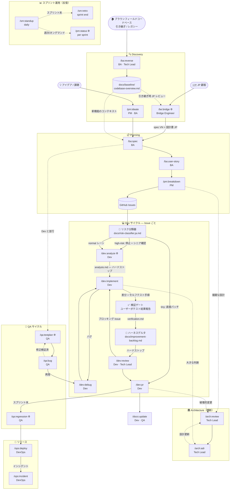

# スキルフローチャート — Agentic Development Lifecycle

SDLC の流れに沿った 26 スキルの関係図。

---

## フル SDLC フロー



---

## ロール別主要フロー

### Bridge Engineer — JP 受託開始
```
JP 顧客 → /be:bridge → /ba:spec (VN) + 設計書 (JP)
```

### ブラウンフィールドオンボーディング — レガシーコードベース引き継ぎ
```
レガシーコードベース → /ba:reverse → docs/baseline/codebase-overview.md
                                  → [オプション /be:bridge JP レビュー]
                                  → /ba:spec（コンテキスト付き新機能向け）
```

### PM / BA — Discovery → Planning
```
/pm:ideate → /ba:spec → /ba:user-story → /pm:breakdown → Issues
```

### Dev — Issue ごと
```
Issue → リスク分類器（tiny/normal/high-risk）
    [normal] → /dev:analyze → [analysis.md レビュー]
                    → /dev:implement → [テスト結果報告 → verification.md]
                    → [ハーネスデルタチェック]
                    → /dev:review → /dev:pr → /docs:update
                         ↕（バグ）
                     /dev:debug
    [tiny]  → 直接パッチ
    [high-risk] → シニア確認 → /dev:analyze → ...
```

### QA — Dev と並列
```
/ba:spec ──→ /qa:testplan ──→ テスト
                                 ↓（バグ発見）
                             /qa:bug → /dev:debug → 再テスト
                                 ↓（リリース前）
                            /qa:regression → /ops:deploy
```

### Architecture — スプリント横断
```
/arch:review ←──→ /arch:adr
     ↑                 ↑
Planning          Dev 判断
```

### Sprint Ops — Scrum 儀式
```
/sm:standup（daily） ──→ /sm:retro（sprint end）
                    ──→ /pm:status（オンデマンド）
```

---

## ゲート依存関係

| スキル | 実行前要件 |
|-------|------------------------|
| `/ba:user-story` | `/ba:spec` 完了 |
| `/pm:breakdown` | `/ba:user-story` または既存ユーザーストーリー |
| `/dev:analyze` | リスク分類器実行済（`docs/risk-classifier.ja.md` 参照）+ Issue/タスク明確（AC 定義済） |
| `/dev:implement` | `docs/tasks/[ID]/analysis.md` 存在 |
| `/dev:review` | `/dev:implement` ステップ 5 完了 + `verification.md` 保存 + ハーネスデルタチェック完了 |
| `/dev:pr` | `/dev:review` Approve + ブロッキング Issue なし |
| `/docs:update` | PR マージ済 |
| `/qa:regression` | スプリント内全 PR マージ済 |
| `/ops:deploy` | `/qa:regression` サインオフ済 |

---

## 記号

| 記号 | 意味 |
|---------|-------|
| `→` | 必須フロー — 必ず通過 |
| `-.->` | オプション / 並列フロー |
| `↕` | ループ（戻ることができる） |
| 🌐 | Markdown 以外に **HTML コンパニオン** を生成 — インタラクティブレビュー成果物（ソート/フィルタ/チェックリストまたは JP↔VN バイリンガル）。ワンショット、コミットしない。`CLAUDE.md` の「Output Format Convention」セクション参照。 |
