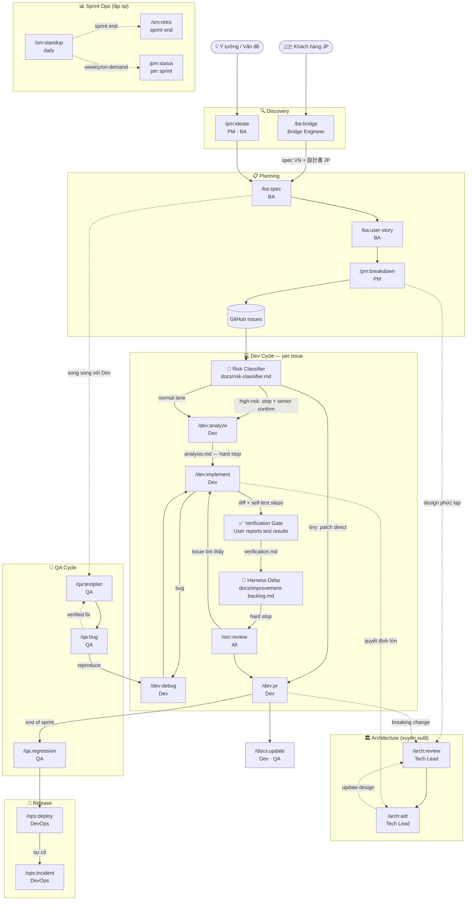

# Skill Flowchart — VTI SDLC Framework

Sơ đồ quan hệ giữa 22 skills theo dòng chảy SDLC.

---

## Full SDLC Flow



---

## Luồng chính theo role

### Bridge Engineer — JP Outsource Entry
```
JP Client → /be:bridge → /ba:spec (VN) + 設計書 (JP)
```

### PM / BA — Discovery → Planning
```
/pm:ideate → /ba:spec → /ba:user-story → /pm:breakdown → Issues
```

### Dev — Per Issue
```
Issue → Risk Classifier (tiny/normal/high-risk)
    [normal] → /dev:analyze → [review analysis.md]
                    → /dev:implement → [report test results → verification.md]
                    → [harness delta check]
                    → /sec:review → /dev:pr → /docs:update
                         ↕ (bug)
                     /dev:debug
    [tiny]  → patch direct
    [high-risk] → senior confirm → /dev:analyze → ...
```

### QA — Parallel với Dev
```
/ba:spec ──→ /qa:testplan ──→ testing
                                 ↓ (bug found)
                             /qa:bug → /dev:debug → retest
                                 ↓ (pre-release)
                            /qa:regression → /ops:deploy
```

### Architecture — Xuyên suốt sprint
```
/arch:review ←──→ /arch:adr
     ↑                 ↑
Planning          Dev decisions
```

### Sprint Ops — Scrum rituals
```
/sm:standup (daily) ──→ /sm:retro (sprint end)
                    ──→ /pm:status (on-demand)
```

---

## Gate dependencies

| Skill | Yêu cầu trước khi chạy |
|-------|------------------------|
| `/ba:user-story` | `/ba:spec` đã done |
| `/pm:breakdown` | `/ba:user-story` hoặc User Stories đã có |
| `/dev:analyze` | Risk Classifier đã chạy (xem `docs/risk-classifier.md`) + Issue/task rõ ràng (AC defined) |
| `/dev:implement` | `docs/tasks/[ID]/analysis.md` đã tồn tại |
| `/dev:pr` | `/dev:implement` Bước 5 done + `verification.md` saved + Harness Delta check done + `/sec:review` passed |
| `/docs:update` | PR đã merge |
| `/qa:regression` | Tất cả PR của sprint đã merge |
| `/ops:deploy` | `/qa:regression` đã sign-off |

---

## Ký hiệu

| Ký hiệu | Nghĩa |
|---------|-------|
| `→` | Luồng bắt buộc — phải đi qua |
| `-.->` | Luồng tùy chọn / parallel |
| `↕` | Loop (có thể quay lại) |
